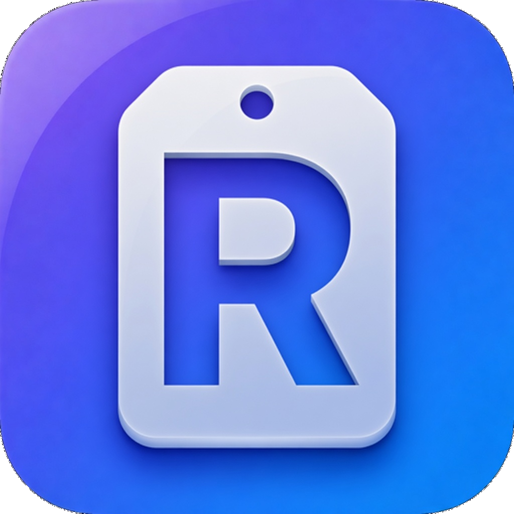

<p align="center">
  
</p>

<h1 align="center">Roster</h1>

<p align="center">
  <a href="README.md">English</a> | <strong>中文</strong> · <a href="CHANGELOG.md">更新日志</a>
</p>

<p align="center">多 AI CLI 指挥台桌面应用，基于 Tauri v2 构建。</p>

最新版本：**v1.2.23** — Qwen 与 MiMo Code 历史续接、可配置单大脑/多干活协作、事务化启动与共享文件安全加固。详情见[更新日志](CHANGELOG.md)。

## 功能特性

- **项目管理** — 添加、编辑、删除项目
- **运行环境（可选）** — 可选本地电脑 / 服务器，也可暂不设置
- **服务器管理** — 配置 SSH 服务器（IP、端口、用户名、密码/秘钥登录方式）
- **分组管理** — 项目分组，侧边栏展开/折叠，点击定位，分组就地重命名（hover → 铅笔，组内项目一起迁移）
- **内置终端** — 应用内底部抽屉多标签终端，集中管理所有会话；支持文件树导览、文件预览与编辑、配色主题、字号调整、拖拽插路径；关标签前先确认并提醒让 AI 更新记忆（详见下方[内置终端使用](#内置终端使用)）
- **多 AI CLI 启动** — 项目卡片一键在项目目录启动 **Claude / Grok / Codex / opencode / Gemini / agy / Qwen / MiMo Code**，标签上有工具色标区分。打开时先聚焦该工具已在跑的标签，否则续接最近一次磁盘会话；没有历史才新开
- **项目历史** — 展开卡片即可搜索、预览、续接或删除各家 CLI 磁盘会话；运行中只对齐明确续接
- **开一套 / 开协作** — 一键打开 Claude + Codex + Grok 主从三窗；协作可从已安装 CLI 中单选一个大脑、多选一个或多个干活终端，共用 `.vibe/orchestra/`
- **统一记忆到 Claude**（可选）— 项目 `.memory` 链到 Claude 项目记忆，默认关闭，不会自动创建 `CLAUDE.md` / `AGENTS.md`
- **终端代理** — 顶栏可选开关，新启动的 CLI 带上 `HTTP_PROXY` / `HTTPS_PROXY` / `ALL_PROXY`，Clash/Surge 本地端口即可，不必 TUN
- **会话状态感知** — 终端会话「持续输出后突然安静」即判定 AI 跑完 / 在等你输入，弹桌面通知 + 提示音 + 标签琥珀呼吸点；正盯着看的会话不打扰，工具栏铃铛可开关
- **Git 状态徽标** — 本地项目卡片显示当前分支、工作区改动（● 已追踪 / + 未追踪）、相对上游领先/落后（↑/↓），干净则绿色 ✓；后台并行扫描，启动 + 窗口聚焦时刷新
- **会话恢复** — 记住上次终端标签布局（目录 + CLI），重开应用询问是否恢复；Claude、OpenCode、Grok、Qwen 与 MiMo Code 用 `--continue` 接回最近对话，Codex 在原项目目录用 `resume --last`；从历史列表指定 Qwen 或 MiMo Code 会话时分别使用 `qwen --resume <id>`、`mimo --session <id>`
- **Prompt 片段库** — 终端工具栏书签图标，存常用 Prompt/命令，点一条注入当前终端（仅文本、不自动回车，可先检查再发送）；管理弹窗增删改，存于 `snippets.json`
- **项目想法** — 终端工具栏灯泡为当前项目保存多条未成形想法，可持续完善、归档，成熟后放入该项目当前 CLI 输入框且不自动回车
- **跨 CLI 交接** — 任意一家已登记 CLI 都能把当前项目的最新会话和 Git 现场交给另一家已安装 CLI，例如 Grok 交给 Claude，来源会话保持不动
- **恢复现场** — 项目卡片历史图标，一张速览接回上次工作：git 概览 + 最近提交 + 改动文件 + CLAUDE.md 摘要 + 上次启动的 CLI；底部一键打开终端 / Claude
- **限流用量（零 Node）** — 用量面板：Claude 走官方 `api/oauth/usage`（5 小时 / 7 天，钥匙串 token，首次弹授权）；Codex 走本机 `codex app-server` 的 `account/rateLimits/read`（ChatGPT 套餐窗口，时长由服务端决定）。缓存 60 秒、秒出
- **菜单栏托盘** — macOS 菜单栏常驻显示 Claude `5h X% · 周 Y%`，每 60 秒刷新；菜单可打开应用 / 刷新 / 退出
- **终端上下文 %** — Claude 会话标签显示 `NN%` 上下文占用（读启动横幅判窗口大小 + transcript 估算，≥70% 橙、≥90% 红），新会话发话前为 0
- **扫描导入** — 扫描目录批量导入 git 项目（自动读取 remote、按路径去重）
- **搜索过滤** — 快速搜索项目名称、路径、描述
- **数据导出** — 导出项目数据为 Excel 文件
- **跨平台** — macOS (Apple Silicon) + Windows (x64 / ARM64)
- **本地存储** — 数据自动保存到本地 JSON 文件

## 项目信息字段

- 项目名称
- 本地路径
- 远端仓库地址
- 项目分组
- 运行环境（可选：本地电脑 / 服务器）
- 服务器关联
- 项目描述

## 内置终端使用

底部抽屉式终端，点项目卡片的终端图标或右下角悬浮按钮打开。

**工作区模式**
- **普通模式**：使用完整终端工作区
- **轻松模式**：在右侧添加并管理自己的网页，仅允许 HTTPS 地址或 localhost 的 HTTP 地址；没有预设网址，不会自动加载第三方网站
- **娱乐模式**：在右侧选择俄罗斯方块或 2048；首次默认俄罗斯方块并记住上次选择，点右侧栏的「终端」可返回 Coding 区
- 工作区模式与配色主题相互独立；任一模式都可切换主题，主题背景和人物效果作用于左侧 Coding 区

**启动 AI CLI**
- 项目卡片底部「打开 CLI」列出本机已装工具，一点即开
- 该工具已在这个项目跑着就切过去；否则续接最近一次磁盘会话。没有历史才新开。标签上显示工具色标（claude 橙 / grok 金 / codex 蓝 / opencode 绿 / gemini 紫 / agy 青 / qwen 粉 / mimo 橙）
- 面板左上「＋」开一个空白终端（不跑任何 CLI）
- 前提：对应 CLI（`grok` / `codex` / `opencode` / `gemini` / `agy` / `qwen` / `mimo`）需已安装并在 PATH 中（终端走登录 shell，能找到）

**文件树 + 预览**（左侧）
- 树根为当前标签所在项目目录，切换标签自动跟随；点文件夹懒加载展开
- **单击文件** → 右侧预览；代码、配置和文本可点预览栏铅笔进入编辑，`⌘/Ctrl + S` 保存；**双击文件** → 把路径插入当前终端
- **拖动**树里的文件/文件夹到终端 → 插入路径（跟 AI 对话指定目录很方便）
- 拖动中间分隔条调整树宽；点工具栏文件夹图标可收起/展开文件树
- 树下半是当前项目的会话条：先列正在跑的 AI 标签（点一下聚焦），再列最近的磁盘会话（点一下续接）。搜索、预览、删除仍在项目卡片。横分隔条可调高度，箭头只收起会话条

**项目想法**
- 活动且仍在运行的终端能匹配已登记项目时，工具栏灯泡才会启用；每个项目拥有独立的多条想法，保存在本机 `ideas.json`
- 想法可随时新增、编辑、归档或删除；项目被移除后留下的想法不会串到别处，可在其他项目抽屉中逐条明确迁入
- 点 **放入当前对话** 会再次核对活动标签和项目，只把单行草稿粘贴到当前 CLI，不按回车；你可继续补充，确认后再发送

**跨 CLI 交接**
- 切到已登记项目中任意一个正在运行的 CLI 标签，点击终端工具栏的双向箭头「交接会话」
- Roster 会从磁盘读取该 CLI 在这个项目里的最新会话，整理可用的最近自然语言内容，并附上当前分支和改动文件；来源格式能够区分的工具调用、思考块和系统提醒不会进入交接稿
- 检查或编辑交接稿，选择本机已安装的任意另一家 CLI 后确认。例如当前是 Grok 时可以选择 Claude。Roster 会把交接稿写到已忽略的 `.vibe/handoff/`，在同一项目新开目标 CLI，并让它先核对交接稿和真实工作区再继续
- 来源标签和所有工作区改动都会保留。交接内容可能发送给目标 CLI 对应的服务，请在确认前删去不想共享的信息

**预览支持的格式**
- **代码 / 配置 / 文本**：语法高亮（几十种语言）并支持直接编辑，保留原有 UTF-8 BOM、LF/CRLF 换行符、文件权限、ACL、扩展属性及平台支持的其他元数据
- **图片**：png / jpg / gif / webp / svg / ico / avif（棋盘格透明底）
- **PDF**：内嵌渲染
- **Markdown**：渲染成排版页面，预览栏「源码 / 渲染」按钮可切换（已做 XSS 净化，任意来源都可安全预览）
- **CSV / TSV**：渲染成表格，可切回源码

编辑器支持 Tab/Shift+Tab 缩进，并在放弃修改、关闭窗口或从托盘退出前提醒。保存采用同目录原子替换，并在替换前尽力检查外部冲突；检测到终端、Git 或其他编辑器改过文件时会停止保存。极端并发写入仍存在无法完全消除的竞争窗口，重要文件建议纳入版本控制。二进制、非 UTF-8、只读、混合换行符或超过 1MB 的文件保持只读预览。

**右键菜单**（树里任意文件/文件夹）
- **打开文件夹**（文件夹 → 在系统文件管理器打开；文件 → 打开所在文件夹）
- **插入路径到终端** / **复制路径**
- **移到废纸篓**（进系统回收站，可恢复；删除前有确认）

**配色主题**
- 点工具栏调色板图标切换：**默认深色** / **Homebrew**，以及预装且可编辑的图片主题 **樱花暮色** / **霓虹雨夜** / 中国风 **黛月华裳**
- 图片主题会启用各自对应的动态鼠标、拖尾与点击粒子；拖动调整区域仍保留系统缩放光标，系统开启“减少动态效果”时会关闭装饰动画
- **黛月华裳**使用 Retina 状态分层：没有任务时，3584×2240 原画保持像素锁定，只让与原图对齐的眼睑、衣料流光、饰品微光和粒子做局部动画；终端一有输出便淡入同一人物坐在中式书案前的 Coding 场景，并通过局部手指与键帽帧循环敲击清晰可见的键盘，重复输出会让场景跨过短暂停顿持续显示。待机不再播放视频，也不使用网格变形或整图位移，因此脸、手和衣纹不会在帧间被替换或软化；素材加载失败或系统开启“减少动态效果”时直接保留 Retina 静态原画
- 打开 **DIY 自定义主题** 可选择内置或本地背景、基础配色、遮罩色/浓度和点击特效，并保存、编辑或删除多套主题

**ESC**
- macOS 上会把 ESC 转发给当前终端，vim / less / Claude Code 可以中断。已打开的弹窗和菜单仍优先消费 ESC。

**字号调整**
- 工作台 / 终端：终端顶栏 **Aa** 按钮。界面选 **标准** / **偏大**（默认偏大）；终端可加减或复位
- 终端快捷键：`⌘/Ctrl +` 放大、`⌘/Ctrl -` 缩小、`⌘/Ctrl 0` 复位，或 `⌘/Ctrl + 滚轮`

**拖拽插路径**
- 从 Finder / 资源管理器拖文件或文件夹到终端面板 → 自动把路径（含空格会加引号）写入当前终端

## 开发环境要求

- Node.js 18+
- pnpm
- Rust 1.70+

## 安装依赖

```bash
pnpm install
```

## 开发运行

```bash
pnpm tauri dev
```

## 构建打包

```bash
pnpm tauri build
```

## 运行测试

```bash
pnpm test
cargo test --manifest-path src-tauri/Cargo.toml
```

手工验收分层动态人物时，在仓库根目录运行 `python3 -m http.server 4174 --bind 127.0.0.1`，再打开 `http://127.0.0.1:4174/tests/terminal-theme-character-fixture.html`。该页面加载生产环境同一套控制器与素材，提供人物状态和静态/动态切换按钮，并可追加 `?compact=1` 检查收起高度；它是人工视觉夹具，不计入 `pnpm test`。

## 技术栈

- **前端**: HTML/CSS/JavaScript (Vanilla)
- **后端**: Rust + Tauri v2
- **数据存储**: JSON 文件
- **Excel 导出**: rust_xlsxwriter
- **内置终端**: portable-pty (真实 PTY，跨平台；Windows 走 ConPTY/PowerShell) + xterm.js (vendor)
- **文件预览与编辑**: highlight.js（高亮）/ marked（Markdown）/ DOMPurify（净化），均 vendor，无 CDN 依赖；Rust 后端负责冲突检测与原子保存

## AI 指令文件

项目根目录的 `CLAUDE.md`、`AGENTS.md`、`opencode.json` 是**本地文件**（已加入 `.gitignore`，不提交到仓库），用于配置 Claude Code、Codex 和 OpenCode 与本项目的交互方式。

## 数据存储位置

- macOS: `~/.roster/`（隐藏目录，避免清理软件误删）
- Windows: `~\.roster\`
- Linux: `~/.roster/`

  首次启动自动从 `~/.vibe-coding-manage/` 和更早的 Application Support 目录迁移。核心文件：
  - `projects.json` — 项目数据
  - `servers.json` — 服务器配置

## 下载

前往 [Releases](https://github.com/luckylee6666/roster/releases) 下载对应平台版本：

| 平台 | 文件 |
| --- | --- |
| macOS (Apple Silicon) | `Roster_x.y.z_aarch64.dmg` |
| Windows x64 | `..._x64-setup.exe`（安装版）或 `..._x64_en-US.msi` |
| Windows ARM64 | `..._arm64-setup.exe`（安装版）或 `..._arm64_en-US.msi`（Surface / 骁龙等 ARM 设备）|

### macOS 安装说明

发布的 DMG 使用 adhoc 签名，首次打开会被 macOS 拦截，请按以下步骤授权：

1. 双击 `.dmg` 文件，将 `Roster.app` 拖入 Applications
2. 首次打开时会提示“已取消”或“移到废纸篓”
3. 打开 **系统设置 → 隐私与安全性**，滚动到底部
4. 在“安全性”区域会看到 `“Roster”已被阻止打开，因为它来自未验证的开发者`
5. 点击 **仍要打开**，输入密码确认即可

### Windows 安装说明

应用未签名，首次运行会弹出 SmartScreen 提示：

1. 下载对应架构的 `*-setup.exe` 双击安装
2. 若弹出 **“Windows 已保护你的电脑”**，点 **更多信息 → 仍要运行**
3. 按 x64 / ARM64 选择对应自己 CPU 架构的安装包
